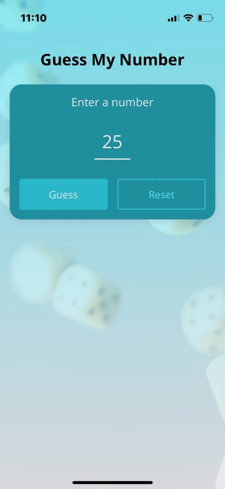
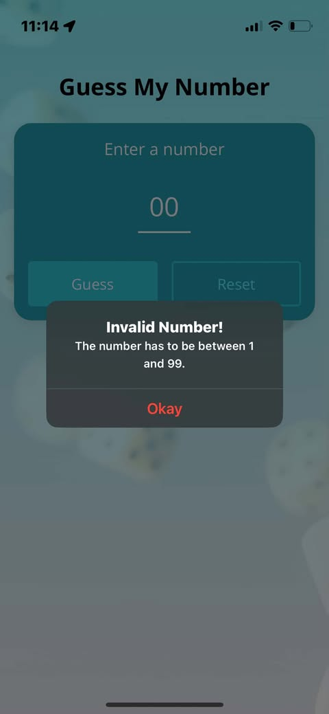
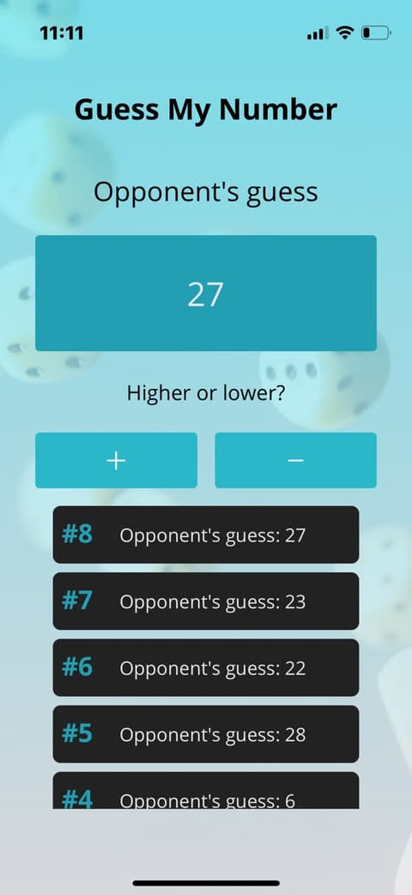
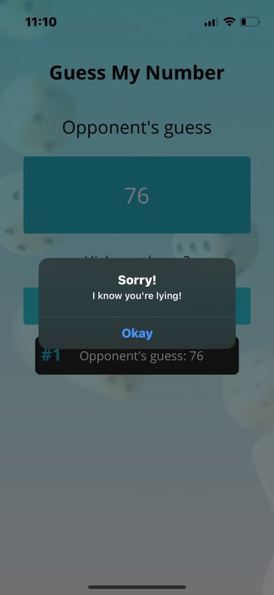

# 🎯 React Native Guess My Number App

## Intro

A fun and interactive **React Native app** built with TypeScript where the **user picks a number**, and the **app tries to guess it**. The user tells the app if its guess is too high or too low — but if the user lies, the app will catch it! 😉

This project helped me explore condition handling, user input, device compatibility, and working with fun alert modals.

---

## 🚀 Tech Stack

-   React Native (with Expo)
-   TypeScript
-   React Native's `StyleSheet`
-   Expo packages like `expo-font`, `expo-app-loading`, and `expo-linear-gradient`

---

## ✨ Features

✅ User picks a number  
✅ App guesses intelligently based on feedback  
✅ User indicates if the guess is too high or low  
✅ Lie detection alert when feedback doesn't match logic  
✅ Displays total rounds taken to guess  
✅ Option to restart the game

---

## 🛠️ Improvements (Future Ideas)

-   Add difficulty levels (e.g., narrow guess range, time limit)
-   Improve design with animation (React Native Reanimated or Lottie)
-   Add sound effects when a guess is correct or wrong
-   UI

---

## 📚 Learnings

-   `elevation` for Android shadow styling
-   `shadowColor`, `shadowOpacity`, `shadowRadius`, `shadowOffset` for iOS shadows
-   Advanced `TextInput` props like `autoComplete`, `keyboardType`, `autoCorrect`
-   Using `Keyboard.dismiss()` from React Native’s `Keyboard` API
-   Working with `ImageBackground` (props like `resizeMode`, `imageStyle`, `source`)
-   Implementing `Alert` for feedback dialogs
-   Safe area handling with `SafeAreaView`
-   Centralized color management using utility color files
-   Typing styles with `{ style: StyleProp<TextStyle> }`
-   Loading and using custom fonts via `expo-font` and `expo-app-loading`
-   Nesting `Text` components
-   Dynamic width with `%`, `maxWidth`, `minWidth`, and `Dimensions` API
-   Landscape mode tweaks in `app.json` (`orientation` property)
-   `useWindowDimensions` to watch layout changes
-   Using `KeyboardAvoidingView`
-   Platform-specific logic using `Platform.OS` and `Platform.select()`
-   Writing `.android.tsx` / `.ios.tsx` files for platform-specific components
-   Status bar handling with `StatusBar`

---

## 📷 Screenshots

  
  
  
  
  

